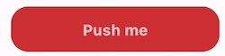

# AtomicDesign package

This is a package provides an Atomic design elemnents for include in flutter projects.

## Features

This package includes (Based in atomic design rules):

- Atoms
- Molecules
- Organisms
- Templates
- Pages

Package has also a Material design theme, that can use light and dark themes.

## Getting started

Be sure to have Dart 3.x and flutter 3.x project.

Include your dependencies in local flutter project:

```yaml
dependencies:
  flutter:
    sdk: flutter
  cupertino_icons: ^1.0.6
  atomicdesign:
    path: ../
```

or from github:

```yaml
dependencies:
  flutter:
    sdk: flutter
  atomicdesign:
    git:
      url: https://github.com/Javierenrique00/retoflutter_fase4.git
      ref: main
      path: atomicdesign
```

Then use the components in your project.

## Usage

Use atom component like a button:

```yaml
    TextButtonAtom(
            textButton: 'Push me',
            onPressedButton: () {},
          )
```

This button is :



For using and with themes:

```Dart
class MainApp extends StatelessWidget {
  const MainApp({super.key});

  @override
  Widget build(BuildContext context) {
    return MaterialApp(
      theme: basicLightThemeFoundation,
      darkTheme: basicDarkThemeFoundation,
      themeMode: ThemeMode.light,
      home: const TabMenu(),
    );
  }
}
```

This package works with `MaterialApp` widget using `basicLightThemeFoundation` and `basicDarkThemeFoundation` then you can use `themeMode`, for example as automatic, light or dark.

All the theme colors are defined internally from the package in the class:

```Dart
abstract class ColorsFoundation {

  static const basicLightThemeSchemaSeed = ColorsToken.red2;
  static const basicLightButtonText = ColorsToken.red1;
  static const basicLightButtonBackground = ColorsToken.red4;
  static const basicWoButtonText = ColorsToken.red4;

}
```

**Important!**

- Now all text and background are alwais inverse, so if the Theme is light text is Dark and background White. If the Theme is dark all the text is white and background is dark.

## Additional information

This package has a minimun functionality and can be improved adding more components.
